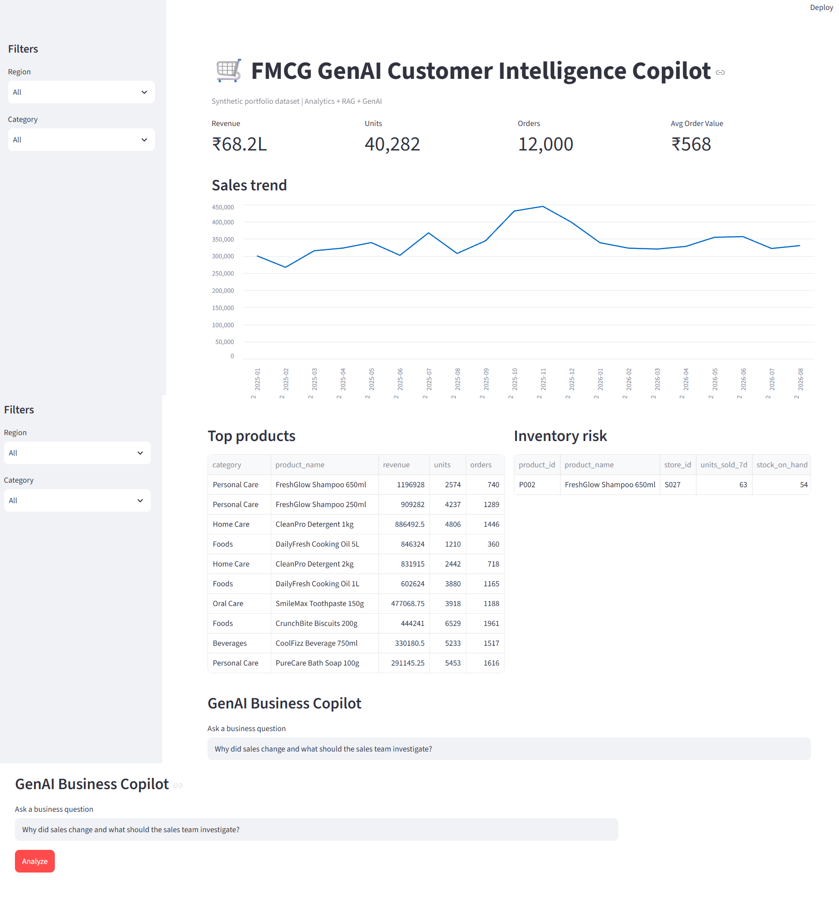

# GenAI FMCG Customer Intelligence Platform

> **An end-to-end Generative AI business intelligence platform for FMCG sales, customers, products, promotions and inventory.**

[](https://www.python.org/)
[](https://fastapi.tiangolo.com/)
[](https://streamlit.io/)
[](#rag--genai-business-copilot)
[](#testing)
[](LICENSE)

---

## 🚀 Overview

The **GenAI FMCG Customer Intelligence Platform** is a portfolio-grade AI application designed to help FMCG business teams answer sales, customer, product, promotion and inventory questions using natural language.

Instead of building a simple chatbot, the platform combines:

- Business analytics
- Customer segmentation
- Product intelligence
- Promotion analysis
- Inventory risk detection
- RAG-based business knowledge retrieval
- GenAI business reasoning
- FastAPI services
- Streamlit business dashboard
- Automated testing
- Docker support

The objective is to demonstrate how **Generative AI can work together with deterministic business analytics** to support faster and more evidence-based decision making.

> **Portfolio / demonstration project:** all transaction and business data in this repository are synthetic and generated for demonstration. No confidential client data is included.

---
## 📸 Application Dashboard



# 🎯 Business Problem

FMCG organizations generate large volumes of information across:

- Customers
- Products
- Categories
- Stores
- Regions
- Sales transactions
- Promotions
- Inventory
- Business documents and SOPs

Business users frequently need answers such as:

> Why did sales decline?

> Which products are driving revenue?

> Which customers are most valuable?

> Which products should we cross-sell?

> Did a promotion improve sales?

> Which products are at stock-out risk?

> What should the sales team investigate next?

Traditional dashboards can provide numbers, but business users still need to manually combine information from multiple sources.

This platform provides a **natural-language business intelligence layer** on top of structured analytics and business knowledge.

---

# 🧠 Solution

```text
                         FMCG Business User
                                |
                                v
                     Streamlit Business UI
                                |
                                v
                           FastAPI API
                                |
              +-----------------+------------------+
              |                                    |
              v                                    v
       Business Analytics                    RAG Knowledge
              |                                    |
       +------+------+------+                +-----+------+
       |      |      |      |                |            |
      Sales Customer Product Inventory      SOPs     Business Docs
       |      |      |      |                |            |
       +------+------+------+                +-----+------+
              |                                    |
              +----------------+-------------------+
                               |
                               v
                    GenAI Business Copilot
                               |
                               v
                Insight + Evidence + Hypotheses
                         + Recommended Actions